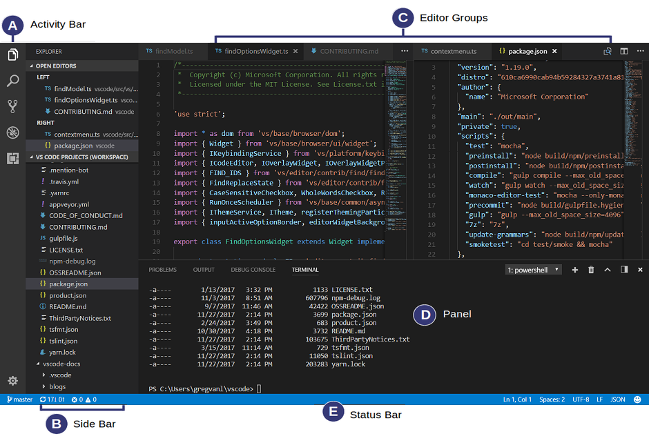

# Lab 1. 基本操作と設定方法

## 1. ユーザーインターフェイス
VS Codeの画面構成と名称を覚えながら操作を試してみましょう。

> **[Note]** [VS Code - User Interface](https://code.visualstudio.com/docs/getstarted/userinterface) サイトにて詳細および最新情報を確認できます。

### 基本レイアウト
**(A) Activity Bar** (アクティビティバー)  
一番左に配置されビューを切り替えることができます。上から順にクリックしてみましょう。  
**(B) Side Bar** (サイドバー)  
プロジェクトなどで作業中に関連した情報が表示されます。  
**(C) Editor** (エディタ)  
ファイルを編集するメインエリアです。  
`[表示] → [エディタレイアウト]` でレイアウト表示をいろいろ変えて試してみましょう。  

**(D) Panel** (パネル)  
出力またはデバッグ情報、エラーと警告の表示、ターミナルなど異なるパネルをエディター下部に表示します。  
`[表示] → [ターミナル]` をクリックしてみましょう。  
**(E) Status Bar** (ステータスバー)  
開いているプロジェクトや編集したファイルに関する情報を表示します。

## 2. コマンドパレット
コマンドからVS Codeを呼び出すための準備を行っておきましょう。
1. `[表示]→[コマンドパレット]` をクリックします。
2. ボックスに[PATH]を入力し、`[シェルコマンド: PATH内に'code'コマンドをインストールします]`を探して選択します。
3. パスが通り、コマンドからVS Codeを呼び出すことができるようになります。
4. OS上でコマンドプロンプトまたはターミナルを起動します。
5. 作業したいディレクトリに移動します。
6. `.code` と入力します。
7. VS Codeがコマンドから呼び出せます。

トラブルシューティングにも役立つ、VS Codeのリロード操作を試しておきましょう。
1. コマンドパレットを呼び出します。
2. `[Developer: ウィンドウの再読み込み]`を探して実行します。
3. VS Codeがリロードされます。

## 3. エクスプローラー
`Explore` アイコンをクリックして操作をいろいろ試してみましょう。
1. フォルダを作成してみます。
2. ファイルを作成してみます。

## 4. 設定
### 配色テーマ
1. VS Code左下の`[管理]アイコン→[配色テーマ]`をクリックする。
2. お好みの配色テーマを探して選択する。
3. VS Codeの配色が変更されます。

### ファイルアイコンのテーマ
1. VS Code左下の`[管理]アイコン→[ファイルアイコンのテーマ]`をクリックします。
2. お好みのアイコンのテーマを選択します。
3. VS Codeのファイルアイコンのデザインが変更されます。
4. お好みのものが見つからない場合には`[管理]アイコン→[ファイルアイコンのテーマ]→[その他のファイルアイコンのテーマをインストール...]`を選択し、拡張機能からインストールします。

## 5. 拡張機能
VS Codeの機能を拡張するためのExtension(拡張機能)は、アイコンまたは **[Visual Studio Code Marketplace](https://marketplace.visualstudio.com/vscode)** サイトで一覧をチェックすることができます。

## 6. 設定ファイル
1. `[管理]アイコン→[設定]`をクリックします。
2. `よく使用するもの` の設定を変更してみましょう。
3. 例えばFile: Auto Saveをonにすると編集しているファイルを自動的に保存します。
4. 画面右上のファイルに矢印がついたアイコンをクリックします。
5. settings.jsonファイルの内容が表示されます。これが、VS Codeの設定ファイルを呼ばれているJSON形式です。拡張機能などによって直接JSONを編集する必要があるため覚えておきましょう。

## 7. よく使いそうな設定例
* ファイルの自動保存 **Files:Auto Save** - on/off
* 行番号の表示 **Editor: Line Numbers** - on/off
* フォントサイズの指定 **Editor: Font Size** - ピクセル単位で6以上の数値で指定
* 行の高さを指定 **Editor: Line Height** - フォントサイズに基づいて計算する場合は0、カスタマイズする場合は数値で指定
* 空白文字の表示 **Editor: Render Whitespace**  
    * none 表示しない
    * boundary　単語間のスペースは表示しない
    * selection 選択した文字にのみ表示する
    * all すべてのスペースを表示する
* クリップボードに文字だけを貼り付ける **Editor: Copy With Syntax Hightlighting** - チェック外す

